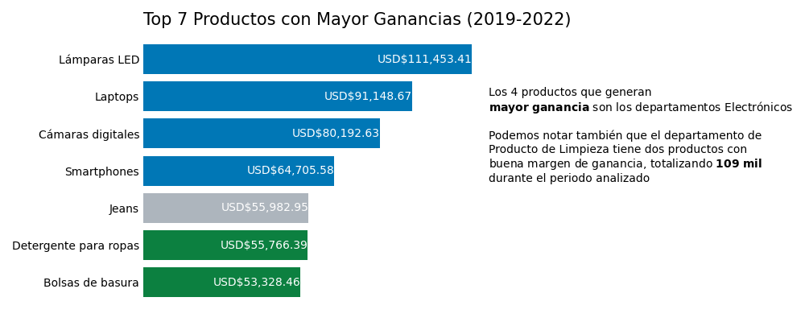
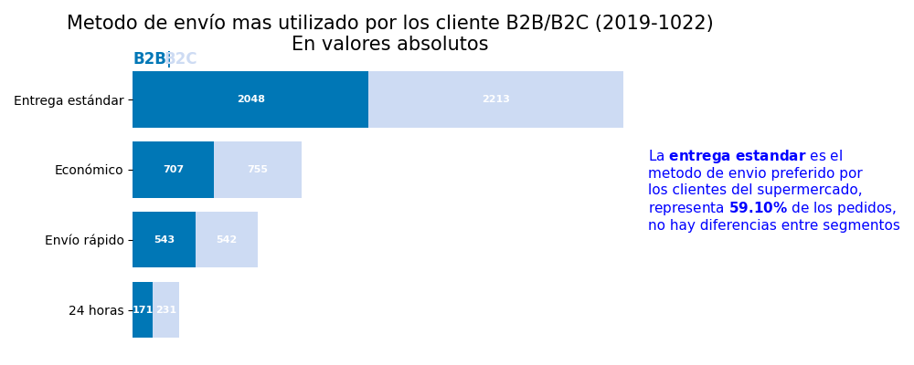
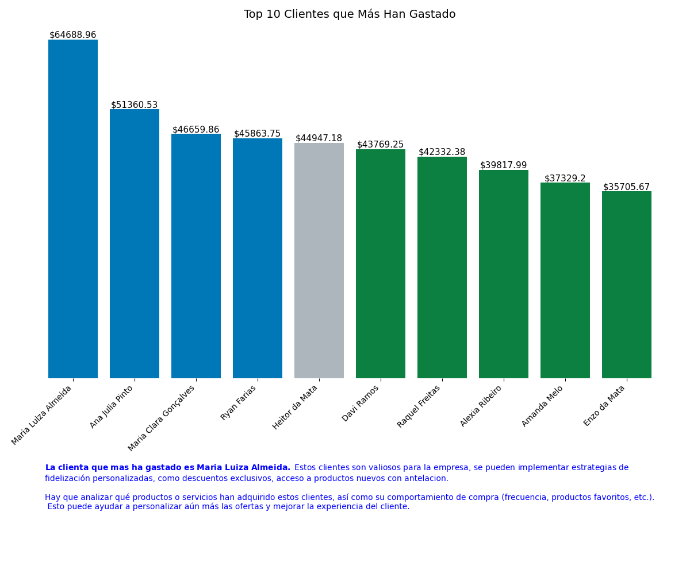
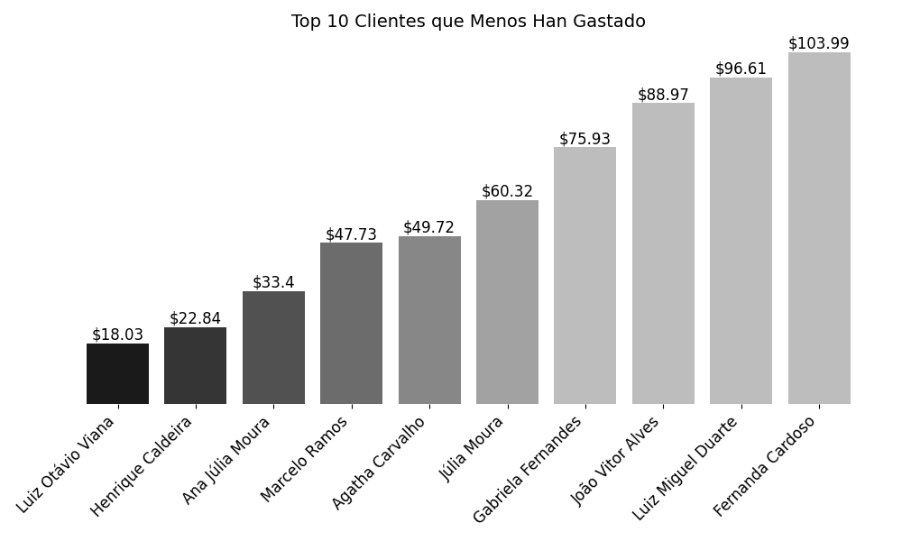

# Análisis de Ventas en Supermercado

## Descripción
Este proyecto realiza un análisis de ventas en un supermercado, con el objetivo de identificar patrones de compra y segmentar clientes.

## Objetivos
- Identificar las ventas anuales y qué año se vedio mas.
- Cuáles son los 7 productos que más ganancias otuvieron.
- Identificar ventas anuales por region
- Identificar los métodos de envío más utilizados.
- Analizar las ventas totales por trimestre en São Paulo.
- Determinar los 10 clientes que más y menos gastaron.

## Tecnologías
- Python
- Pandas
- Matplotlib
- Seaborn

## Instalación
https://github.com/Danielvillarreal1/analisis-mercado.git

## Graficos
--------------------------------

--------------------------------

--------------------------------

--------------------------------

--------------------------------

--------------------------------

--------------------------------

